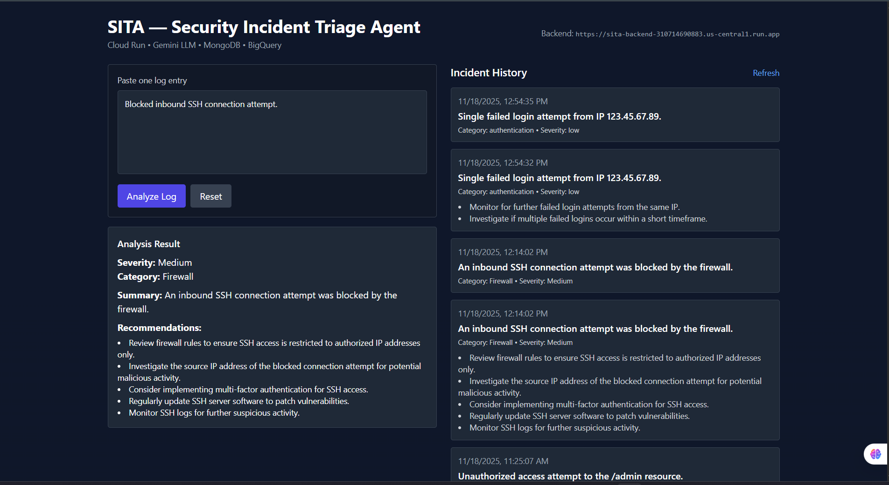
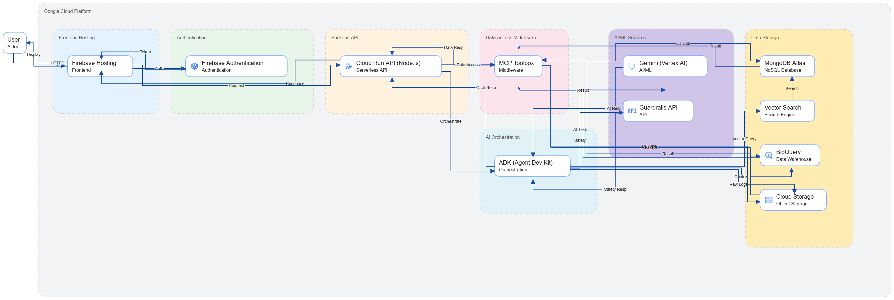

# 🔐 SITA – Security Incident Triage Agent

AI-Powered Real-Time Cloud Security Monitoring for Modern Teams

---


## 🌟 Introduction

Cloud platforms generate thousands of logs every minute, including:

* Authentication failures
* Access events
* Network anomalies
* System warnings
* User activity trails

Security teams still struggle with:

* ❗ Manual log review
* ❗ Delayed detection
* ❗ Siloed monitoring tools
* ❗ No unified threat visibility

To solve this, **SITA – Security Incident Triage Agent** provides an end-to-end real-time cloud security monitoring platform powered by AI.

---

## ✅ SITA Alerts – Key Capabilities

* ⚡ **AI-driven log analysis**
* ☁ **One-click GCP integration** (Pub/Sub + Logging Sink)
* 📡 **Real-time alerts via WebSockets**
* 📊 **Live cybersecurity dashboards**
* 💾 **Historical log storage with MongoDB**
* 🎨 **Dark-mode UI optimized for SOC workflows**
* 🤖 **Live AI Agent** → [https://sita-frontend-310714690883.us-central1.run.app/](https://sita-frontend-310714690883.us-central1.run.app/)

---

## 🏗 Architecture


### ⚙ Why This Architecture?

* **Serverless backend** → Auto-scales ingestion & processing
* **Pub/Sub** → Reliable, durable log delivery
* **Socket.IO** → Instant real-time push alerts
* **LLM Analyzer** → Contextual understanding of security events
* **MongoDB** → Ideal for semi-structured log storage

---

## 🎯 Problem Statement

Cloud logs are:

* Huge
* Fast-growing
* Hard to analyze manually
* Not actionable without context

Incidents often go unnoticed due to:

* ❌ No 24/7 log monitoring
* ❌ Missing severity & root cause
* ❌ No real-time alerting
* ❌ Static dashboards with no live insights

---

## 🛡 SITA Alerts – Solution Overview

### ✔ AI Log Analysis

Paste/upload any log to instantly get:

* Severity
* Category
* Summary
* Root Cause
* Recommended Actions

### ✔ One-Click Cloud Integration

Automatically sets up:

* Pub/Sub Topic
* Subscription
* Push Endpoint
* Logging Sink

### ✔ Real-Time Dashboard Includes:

* Live alert stream
* Severity distribution charts
* Time-series attack trends
* Category-wise breakdown
* Alerts table with filters

### ✔ SOC-Optimized Dark UI

Clean, fast, security-team friendly.

---

## 🧠 How AI Log Analysis Works

**Example Log:**

```
2025-11-18 07:58:01 ERROR Failed login attempt from IP 1.2.3.4
```

**AI Output:**

* Severity: High
* Category: Authentication
* Summary: Failed login attempt
* Root Cause: Invalid credentials / brute force attempt
* Recommended Actions:

  * Check geo-IP
  * Apply login rate limits
  * Enforce MFA

---

## 🛠 Implementation

### 🖥 Backend (Node.js + Express + Socket.IO)

#### Key Endpoints

| Endpoint         | Purpose                           |
| ---------------- | --------------------------------- |
| `/analyze-log`   | AI log analyzer                   |
| `/logs`          | Fetch stored logs                 |
| `/connect-cloud` | Auto-setup Pub/Sub + Logging Sink |
| `/pubsub/push`   | Receive log events                |
| `/ws`            | WebSocket alerts                  |

### 🎨 Frontend (React + Vite + Tailwind)

**Screens:**
1️⃣ **Home Page**

* Log input
* File upload
* Analyze Log
* Connect to Cloud

2️⃣ **Dashboard**

* Live alerts
* Severity charts
* Time-series graphs
* Alerts table

---

## 📊 Demo Video

*(Placeholder)* [https://youtu.be/ci1u1_demo_link_example](https://youtu.be/ci1u1_demo_link_example)

---

## 📈 Results

After deploying SITA Alerts:

* ⚡ Real-time alerts appear instantly
* 🤖 AI interprets logs with accuracy
* 🛡 Zero manual log reading
* 🚨 Threats surface immediately
* 📊 Dashboard provides complete security visibility

---

## 🧭 Future Enhancements

* Multi-cloud support (AWS / Azure)
* Slack & Teams integrations
* ML-driven anomaly detection
* RBAC access control
* Automated incident response (SOAR)

---

## 🏁 Conclusion

**SITA Alerts transforms raw cloud logs into actionable security intelligence in real time.**
Perfect for teams who want to:

* ✔ Strengthen cloud security
* ✔ Automate threat monitoring
* ✔ Add AI to log analysis

---

## ⭐ GitHub & Live Agent

* **GitHub:** [https://github.com/vannoorsab/SITA.git](https://github.com/vannoorsab/SITA.git)
* **Live AI Agent:** [https://sita-frontend-310714690883.us-central1.run.app/](https://sita-frontend-310714690883.us-central1.run.app/)

---

## 🔔 Call to Action

To learn more about Google Cloud services and create real-world impact, follow these steps:

* **📚 Register for Code Vipassana sessions**
* **🤝 Join the meetup group Datapreneur Social**
* **🚀 Sign up to become a Google Cloud Innovator**
